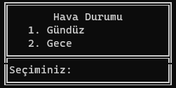
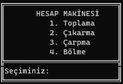
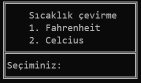
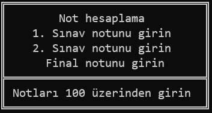

# konsolProje01
<h2>Konsol Projesi</h2>

Vektörel bilişim python kursu için ilk proje.

İçerisinde <i>Hava durumu</i>, <i>Hesap makinesi</i>, <i>Sıcaklık çevirme</i> ve <i>Not hesaplama</i> programları vardır

