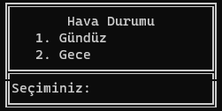
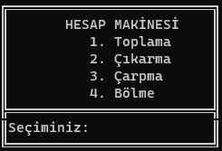
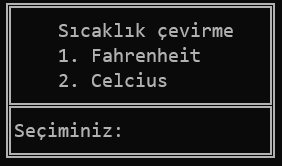
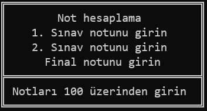

# konsolProje01
<h2>Konsol Projesi</h2>

Vektörel bilişim python kursu için ilk projeyi içerir.

İcerisinde <i>Hava durumu</i>, <i>Hesap makinesi</i>, <i>Sıcaklık çevirme</i> ve <i>Not hesaplama</i> programları vardır

<h5><i>Hava Durum</i></h5>
</img>
<h5><i>Hesap Makinesi</i></h5>

<h5><i>Sıcaklık Çevirme</i></h5>

<h5><i>Not Hesaplama</i></h5>

<h5><i>Robot Çizimi</i></h5>

<em>Turtle kütüphanesi</em> ile <stront>robot</strong> çizer

