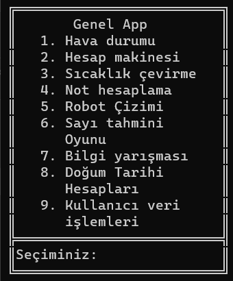

# konsolProje01
<h2>Konsol Projesi</h2>

<i>Vektörel bilişim</i> python kursu için ilk projesi olup, konsol ile çağırılabilen aşağıdaki programları içerir.  

<h5><i>Ana Sayfa</i></h5>

Programların listelendiği sayfadır.

<h5><i>Hava Durum</i></h5>

Hava durumunu gece ve gündüz olarak görüntüler

<h5><i>Hesap Makinesi</i></h5>

Dört işlem hesaplamaları yapar

<h5><i>Sıcaklık Çevirme</i></h5>

Girilen Fahrenheit veya Celcius sıcaklık değerlerini diğer sıcaklık birimine çevirir. 

<h5><i>Not Hesaplama</i></h5>

Yıl sonu üniversite harf notunuzu hesaplar ve kalıp ya da geçtiğinizi ekrana yazdırır 

<h5><i>Robot Çizimi</i></h5>

<em>Turtle kütüphanesi</em> ile <strong>robot</strong> çizer.

<h5><i>Sayı tahmin oyunu</i></h5>

Bilgisayar 1 ila 100 arasında bir sayı tutar ve siz bu sayıyı bilmeğe çalışırsınız.

<h5><i>Bilgi Yarışması</i></h5>

 5 soruluk bilgi yarışması. Random kütüphanesi ile soru havuzundan rastgele 5 tane soru seçer. Cevaplara göre skorunuzu yazdırır.

<h5><i>Doğum Tarihi Hesaplamaları</i></h5>

Herhangi bir doğum tarihinden, kişinin yaşını, hangi günde doğduğunu ve burcunu bildirir. 

